# 📐 修正後のER図（完全版）

## 概要

syncworks-site（引越し業者管理システム）のデータベース設計。
全19テーブルで構成され、見積依頼から案件完了までの業務フローを管理。

---

## Mermaid形式のER図

```mermaid
erDiagram
    %% ==================== コアエンティティ ====================

    users ||--o{ moving_companies : "owns"
    users ||--o{ employees : "is"
    users ||--o{ real_estate_agents : "is"
    users ||--o{ referrers : "is"

    users {
        uuid id PK
        varchar email UK
        varchar password_hash
        varchar name
        varchar role
        uuid moving_company_id FK
        uuid employee_id FK
        uuid real_estate_agent_id FK
        boolean is_active
        boolean email_verified
        timestamp email_verified_at
        timestamp last_login_at
        timestamp created_at
        timestamp updated_at
    }

    moving_companies {
        uuid id PK
        varchar name
        varchar phone
        varchar email
        varchar address
        boolean is_active
        timestamp created_at
        timestamp updated_at
    }

    %% ==================== 従業員・リソース管理 ====================

    moving_companies ||--o{ employees : "employs"
    moving_companies ||--o{ trucks : "owns"

    employees {
        uuid id PK
        uuid moving_company_id FK
        varchar name
        varchar email
        varchar phone
        varchar role
        varchar position
        varchar employment_type
        date hire_date
        date retire_date
        date birth_date
        varchar status
        boolean is_active
        varchar address
        varchar emergency_contact
        text qualifications
        timestamp created_at
        timestamp updated_at
    }

    trucks {
        uuid id PK
        uuid moving_company_id FK
        varchar name
        varchar plate_number
        varchar truck_type
        int capacity_kg
        int capacity_points
        date inspection_expiry
        varchar status
        timestamp created_at
        timestamp updated_at
    }

    employees ||--o{ shifts : "has"
    trucks ||--o{ shifts : "assigned_to"

    shifts {
        uuid id PK
        uuid employee_id FK
        date date
        time start_time
        time end_time
        varchar time_slot
        uuid job_id FK
        uuid truck_id FK
        varchar customer_name
        varchar work_type
        varchar status
        text notes
        timestamp created_at
        timestamp updated_at
    }

    %% ==================== 不動産・紹介者管理 ====================

    real_estate_agents {
        uuid id PK
        varchar company_name
        varchar license_no UK
        varchar representative_name
        varchar contact_name
        varchar department
        varchar phone
        varchar email
        varchar address
        varchar website_url
        text[] service_prefectures
        varchar referral_code UK
        varchar registration_mode
        varchar referrer_name
        boolean is_active
        timestamp created_at
        timestamp updated_at
    }

    referrers {
        uuid id PK
        varchar referrer_type
        varchar display_name
        varchar phone
        varchar email
        varchar address
        varchar company_name
        varchar department
        varchar full_name
        varchar full_name_kana
        date birth_date
        varchar tax_category
        boolean withholding_tax
        varchar bank_code
        varchar branch_name
        varchar account_number
        varchar account_holder
        boolean terms_accepted
        timestamp terms_accepted_at
        boolean is_admin
        boolean is_active
        timestamp created_at
        timestamp updated_at
    }

    referrers ||--o{ referral_cases : "refers"

    referral_cases {
        uuid id PK
        uuid referrer_id FK
        varchar referrer_type
        uuid quote_request_id FK
        varchar customer_anonymous_id
        varchar customer_area
        date moving_date
        varchar status
        int contract_amount
        int commission_amount
        decimal commission_rate
        date application_date
        timestamp created_at
        timestamp updated_at
    }

    %% ==================== 見積依頼フロー ====================

    real_estate_agents ||--o{ quote_requests : "refers"

    quote_requests {
        uuid id PK
        varchar customer_last_name
        varchar customer_first_name
        varchar customer_last_name_kana
        varchar customer_first_name_kana
        varchar customer_phone
        varchar customer_email
        uuid referrer_agent_id FK
        varchar referral_id
        varchar move_type
        varchar from_postal_code
        varchar from_prefecture
        varchar from_city
        varchar from_address_detail
        varchar property_type_from
        int floor_from
        boolean has_elevator_from
        varchar to_postal_code
        varchar to_prefecture
        varchar to_city
        varchar to_address_detail
        varchar property_type_to
        int floor_to
        boolean has_elevator_to
        date preferred_date_1
        varchar preferred_time_slot_1
        date preferred_date_2
        varchar preferred_time_slot_2
        date preferred_date_3
        varchar preferred_time_slot_3
        varchar status
        varchar priority
        varchar source_type
        timestamp request_date
        date deadline
        boolean packing_delivery
        date packing_deadline
        boolean packing_delivery_completed
        text notes
        timestamp created_at
        timestamp updated_at
    }

    quote_requests ||--o{ moving_items : "contains"

    moving_items {
        uuid id PK
        uuid quote_request_id FK
        varchar category
        varchar item_name
        int quantity
        int points_per_unit
        int total_points
        int additional_cost
        timestamp created_at
    }

    quote_requests ||--o{ quotes : "receives"
    moving_companies ||--o{ quotes : "provides"

    quotes {
        uuid id PK
        uuid quote_request_id FK
        uuid moving_company_id FK
        varchar quote_type
        int base_price
        int discount_amount
        int tax_amount
        int total_price
        int breakdown_base_price
        int breakdown_distance_price
        int breakdown_option_price
        int breakdown_total_points
        varchar recommended_truck
        int adjustment_amount
        decimal adjustment_rate
        varchar adjustment_reason_type
        text adjustment_reason_desc
        varchar status
        date valid_until
        text response_comment
        text message_to_customer
        timestamp responded_at
        varchar responded_by
        timestamp created_at
        timestamp updated_at
    }

    quotes ||--o{ quote_options : "has"
    options ||--o{ quote_options : "selected_in"

    quote_options {
        uuid id PK
        uuid quote_id FK
        uuid option_id FK
        int quantity
        int unit_price
        int total_price
        timestamp created_at
    }

    %% ==================== 案件管理 ====================

    quotes ||--o{ jobs : "becomes"
    moving_companies ||--o{ jobs : "handles"
    real_estate_agents ||--o{ jobs : "referred_by"

    jobs {
        uuid id PK
        uuid quote_id FK
        uuid quote_request_id FK
        uuid moving_company_id FK
        uuid referrer_agent_id FK
        varchar customer_name
        varchar customer_phone
        varchar customer_email
        varchar from_address
        varchar to_address
        int total_points
        decimal distance
        date scheduled_date
        timestamp scheduled_start_time
        timestamp scheduled_end_time
        varchar time_slot
        int estimated_duration
        timestamp actual_start_time
        timestamp actual_end_time
        int crew_size
        int truck_count
        jsonb selected_options
        varchar payment_method
        varchar payment_status
        int payment_amount
        date payment_due_date
        date contract_date
        varchar status
        text notes
        timestamp created_at
        timestamp updated_at
    }

    jobs ||--o{ shifts : "assigned_to"
    jobs ||--o{ job_assignments : "has"

    employees ||--o{ job_assignments : "assigned_to"
    trucks ||--o{ job_assignments : "assigned_to"

    job_assignments {
        uuid id PK
        uuid job_id FK
        uuid employee_id FK
        uuid truck_id FK
        varchar assignment_type
        timestamp assigned_start_time
        timestamp assigned_end_time
        timestamp created_at
        timestamp updated_at
    }

    jobs ||--o{ reviews : "reviewed_for"

    reviews {
        uuid id PK
        uuid job_id FK
        varchar customer_email
        int rating
        text comment
        boolean is_verified
        text company_response
        timestamp company_response_at
        timestamp created_at
        timestamp updated_at
    }

    %% ==================== マスタデータ ====================

    item_masters {
        uuid id PK
        varchar category
        varchar name UK
        int default_points
        int default_additional_cost
        varchar typical_size
        int typical_weight
        boolean is_fragile
        boolean requires_disassembly
        int display_order
        boolean is_active
        timestamp created_at
        timestamp updated_at
    }

    pricing_rules {
        uuid id PK
        varchar truck_type
        int min_point
        int max_point
        int base_price
        decimal price_per_km
        date valid_from
        date valid_until
        boolean is_active
        timestamp created_at
        timestamp updated_at
    }

    options {
        uuid id PK
        varchar name UK
        varchar label
        text description
        varchar option_type
        int price
        varchar unit
        int min_point
        int max_point
        boolean is_default
        int display_order
        boolean is_active
        text remarks
        timestamp created_at
        timestamp updated_at
    }

    season_rules {
        uuid id PK
        varchar name
        text description
        date start_date
        date end_date
        varchar price_type
        decimal price
        boolean is_recurring
        varchar recurring_type
        jsonb recurring_pattern
        int recurring_end_year
        boolean is_active
        timestamp created_at
        timestamp updated_at
    }

    %% ==================== 通知システム ====================

    notifications {
        uuid id PK
        varchar recipient_email
        varchar recipient_type
        varchar notification_type
        varchar title
        text message
        jsonb data
        varchar priority
        boolean is_read
        timestamp read_at
        timestamp expires_at
        timestamp created_at
    }

    %% ==================== リレーション（紹介案件） ====================

    referral_cases ||--o{ quote_requests : "linked_to"
```



---

## テーブル一覧

### 1. コアエンティティ（2テーブル）
- **users**: システム全体のユーザー認証
- **moving_companies**: 引越し業者の基本情報

### 2. 従業員・リソース管理（3テーブル）
- **employees**: 従業員情報
- **trucks**: トラック情報
- **shifts**: シフト管理

### 3. 不動産・紹介者管理（3テーブル）
- **real_estate_agents**: 不動産仲介業者
- **referrers**: 紹介者（個人・法人）
- **referral_cases**: 紹介案件

### 4. 見積依頼フロー（4テーブル）
- **quote_requests**: 見積依頼
- **moving_items**: 引越し荷物
- **quotes**: 見積
- **quote_options**: 見積オプション（中間テーブル）

### 5. 案件管理（3テーブル）
- **jobs**: 受注案件
- **job_assignments**: 案件割り当て（中間テーブル）
- **reviews**: レビュー

### 6. マスタデータ（4テーブル）
- **item_masters**: 荷物マスタ
- **pricing_rules**: 料金ルール
- **options**: オプションマスタ
- **season_rules**: シーズン加算ルール

### 7. システム機能（1テーブル）
- **notifications**: 通知

---

## 主要なデータフロー

### 見積依頼 → 見積 → 受注 → 完了

```
[顧客]
  ↓ 見積依頼入力
[quote_requests] ← [moving_items]
  ↓ 業者が見積回答
[quotes] ← [quote_options]
  ↓ 顧客が承認
[jobs] ← [job_assignments]
  ↓ 作業完了
[reviews]
```

### 紹介案件フロー

```
[referrers/real_estate_agents]
  ↓ 案件紹介
[referral_cases]
  ↓ 見積依頼作成
[quote_requests]
  ↓ （通常フロー）
[quotes] → [jobs]
  ↓ 成約時
[referral_cases].commission_amount 計算
```

### リソース管理フロー

```
[employees] ← [shifts] → [trucks]
       ↓                    ↓
  [job_assignments] ← [jobs]
```

---

## 外部キー制約の方針

| リレーション | ON DELETE | 理由 |
|------------|-----------|------|
| moving_items → quote_requests | CASCADE | 見積依頼削除時、荷物も削除 |
| quotes → quote_requests | CASCADE | 見積依頼削除時、見積も削除 |
| quote_options → quotes | CASCADE | 見積削除時、オプションも削除 |
| jobs → quotes | RESTRICT | 案件がある見積は削除不可 |
| job_assignments → jobs | CASCADE | 案件削除時、割り当ても削除 |
| shifts → employees | CASCADE | 従業員削除時、シフトも削除 |
| shifts → jobs | SET NULL | 案件削除時、シフトは残す（割り当て解除） |
| employees → moving_companies | CASCADE | 業者削除時、従業員も削除 |
| trucks → moving_companies | CASCADE | 業者削除時、トラックも削除 |

---

## インデックス戦略

### 1. 検索頻度が高いカラム
- `quote_requests.status`
- `quotes.status`
- `jobs.status`
- `employees.status`
- `trucks.status`

### 2. 外部キー
- すべての外部キーにインデックス作成

### 3. 日付カラム
- `quote_requests.request_date`
- `jobs.scheduled_date`
- `shifts.date`

### 4. 全文検索
- `quote_requests.customer_email`
- `quote_requests.customer_*_name`

---

## パーティショニング推奨テーブル

データ量増加に備え、以下のテーブルは月別パーティショニングを推奨：

1. **quote_requests** - request_date で分割
2. **quotes** - created_at で分割
3. **jobs** - scheduled_date で分割
4. **shifts** - date で分割
5. **notifications** - created_at で分割

---

## 生成日時

- 作成日: 2025-01-24
- 最終更新: 2025-01-24
- バージョン: 1.0.0

---

## 関連ドキュメント

- [テーブル定義書](./TABLE-DEFINITIONS.md)
- [DDLスクリプト](./ddl/)
- [マイグレーション計画](./MIGRATION-PLAN.md)
